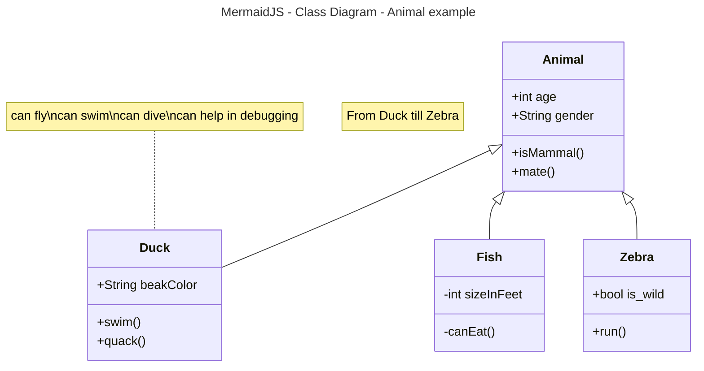

# Activity 1

- This is Activity 1...

Cheers! :beers:

## Fruits
1. Apples
     1. Red
     2. Yellow
     3. Green
2. Oranges
3. Pears

## Links / Images

[google](https://www.google.com)

[wikiBob](https://gitlab.com/bobby.estey/wikibob/-/blob/master/README.md)


## Tables
|First Name|Last Name|
|--|--|
|Chris|King|
|Bobby|Estey|

```java
public class CodeBlock {
    public static void main(String[] args) {
        System.out.println("Code Block Example");
    }
}
```

```python
print("Hello world!")
```

