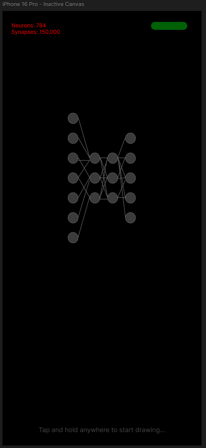

# Activity 2  
**Chris King**  
Grand Canyon University  
SDD-630 Mobile Software Development  
Professor Estey  
May 21, 2025

## Introduction  
Project TARS is a mobile application designed to visualize the inner workings of a neural network in real time. The app allows users to draw digits (0–9) and immediately observe how the model processes the input, lighting up neurons and synapses as it reaches a prediction. A corresponding natural language message appears based on the model’s confidence score. The app is built to be responsive, engaging, and educational—bridging the gap between abstract AI systems and user intuition. This document outlines the initial user stories and categorizes them based on implementation priority.

## User Stories  

| **Essential Features (MVP)**                                                                 | **Nice to Have**                                                                                   | **Future Versions**                                                                                       |
|----------------------------------------------------------------------------------------------|-----------------------------------------------------------------------------------------------------|------------------------------------------------------------------------------------------------------------|
| As a user, I want to draw a digit on the canvas so that the neural network can interpret it. | As a user, I want to switch between different models (e.g., digit recognition vs. voice input).    | As a user, I want to click on a neuron to see its properties and current activation.                      |
| As a user, I want to watch the neural network activate in real time as I draw.               | As a user, I want to enable dark mode for a better visual experience.                              | As a user, I want to click on synapses to view weights and connections.                                   |
| As a user, I want to receive a confidence-based natural language response after prediction.  | As a user, I want my input to replay on loop until I enter another input.                          | As a user, I want to load custom models into the app from external sources.                               |
| As a user, I want to see total neurons and synapses displayed clearly in the corner.         | As a user, I want to share my visualized results via social media.                                 | As a user, I want to adjust the learning parameters and watch the model adapt in real time.               |
| As a user, I want to see a WebSocket connection indicator at the top of the screen.          | As a user, I want to toggle between slow-motion and real-time network visualization.               | As a user, I want to select different datasets and tasks (e.g., letters, symbols) to test the model.      |
| As a user, I want the prediction message to reflect high or low confidence appropriately.    | As a user, I want to tap a help icon to view instructions and explanations of the visualization.   | As a user, I want to view training history and accuracy graphs for the loaded model.                      |
| As a user, I want the canvas to reset easily so I can try another digit.                     | As a user, I want to zoom in on different sections of the neural network.                          | As a user, I want to run experiments and track neuron/synapse-level metrics over time.                    |
| As a user, I want to be notified if the WebSocket disconnects or reconnects during use.      | As a user, I want to toggle background gridlines on the canvas.                                    | As a user, I want to interact with layers of the neural net individually for learning purposes.           |

## Interactive UI  

While the app is inactive, the screen displays a neutral, dormant neural network along with a subtle hint at the bottom guiding the user to “Tap and hold anywhere to draw a digit.” A green status pill confirms the WebSocket connection, and model stats are visible in the top-left corner.  

While the user is drawing, the canvas becomes active—appearing as a semi-transparent frosted glass panel that overlays the entire screen. The hint disappears, and the neural network graphic subtly animates into an active state, visually reinforcing that computation is happening in real time.  

When the user releases their hold to stop drawing, they simply tap the screen once more. This triggers the canvas to fade out, leaving the drawing behind for processing. The neural network lights up in live time, giving visual feedback as the prediction is made and the result is rendered as a natural language response.  

## Demo  

<video controls src="20250522-0619-27.0139425.mp4" title="Project TARS Interactive Demo"></video>
